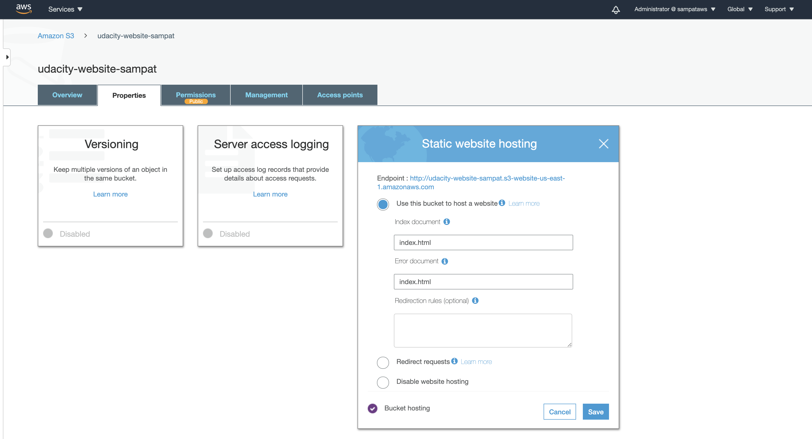

#Project Deploy Static Website In AWS S3

**Step1**
* Bucket Creation - > BucketName = ``` udacity-website-sampat ```:
    
**Step2**
* Upload Web files inside the BucketName = ``` udacity-website-sampat ```:
    
**Step3**
* Setting the permission policy for BucketName = ``` udacity-website-sampat ```:
    
**Step4**
* Enabling the property for Static Web inside the BucketName properties = ``` udacity-website-sampat ```:
    
**Step4**
* Enabling the property for Static Web inside the BucketName properties = ``` udacity-website-sampat ```:
    
**Step5**
* Deploy Files to Cloud Front:
    
**Step6**
* Access Web Page from the browser with URL -> https://d809i89wr1ukz.cloudfront.net/index.html
    
    


