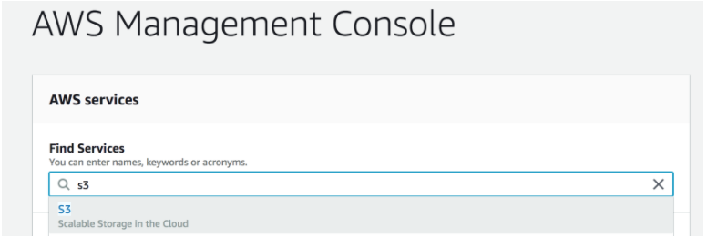
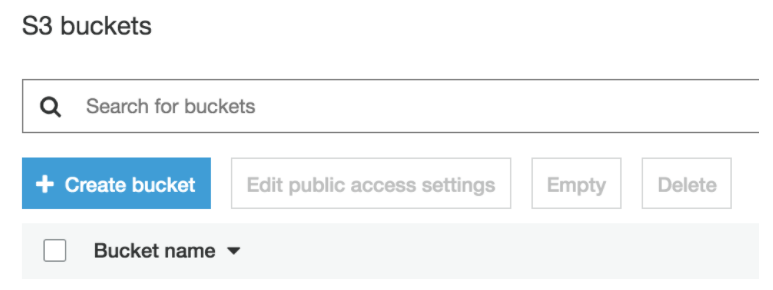
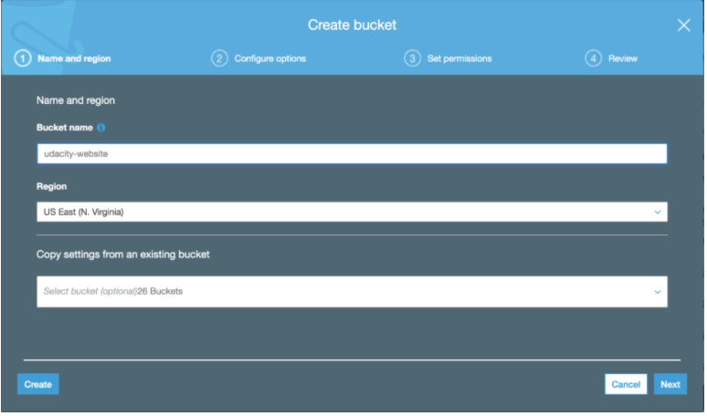
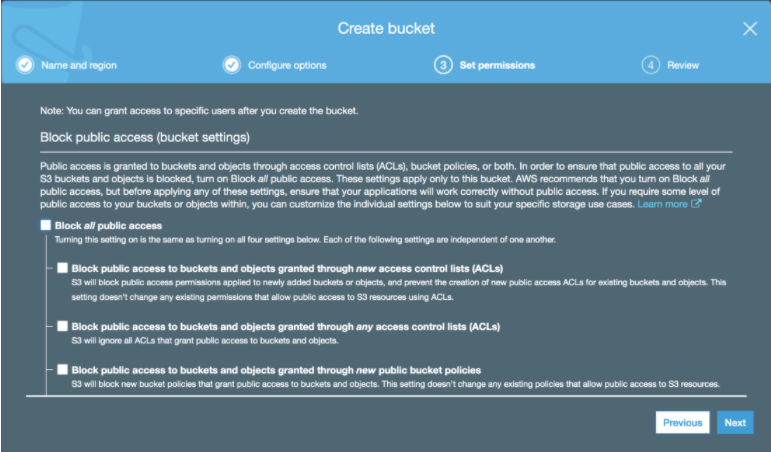
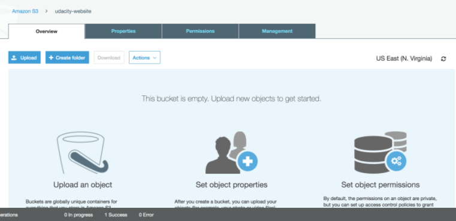

#Create S3 Bucket
1. Navigate to the ```AWS Management Console``` page, type ```S3``` in the ```Find Services``` box and then select ```S3```.
    
2. The Amazon S3 dashboard displays. Click ```Create bucket```.
    
3. Enter a ```Bucket name``` and click ```Next```. Note: Bucket names must be globally unique.
    
4. Click ```Next``` again to skip over ```Step 2: Configure Options```.
5. On ```Step 3: Set Permissions```, uncheck ```Block all public access```
    
6. Click ```Next``` and click ```Create bucket```.
7. Once the bucket is created, click on the name of the bucket to open the bucket to the contents.
    
