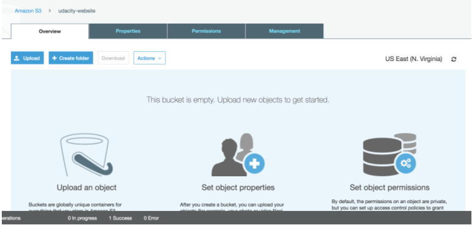
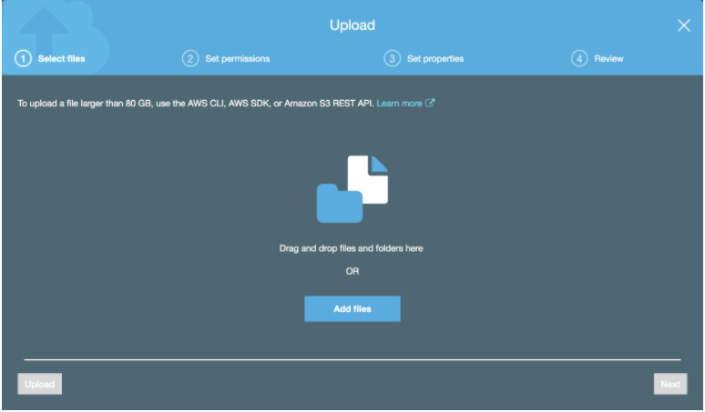
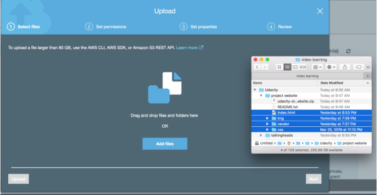
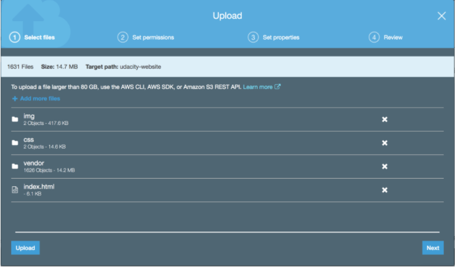

#Upload files to S3 Bucket
1. Once the bucket is open to its contents, click the ```Upload``` button.
    
2. Click the ```Add Files``` button and drag and drop files and folders from your local computer to the S3 bucket and select ```Upload```. Note: Upload the downloaded student-ready starter code files.
    
    
    


