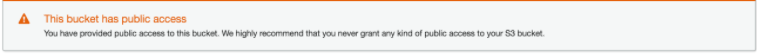

#Secure Bucket via IAM

1. Click on the ```Permissions``` tab.
    
2. Click on ```Bucket Policy``` and enter the bucket policy below replacing ```your-website``` with the name of your bucket and click ```Save```.
    ```json
           {
             "Version":"2012-10-17",
             "Statement":[
               {
                 "Sid":"AddPerm",
                 "Effect":"Allow",
                 "Principal": "*",
                 "Action":["s3:GetObject"],
                 "Resource":["arn:aws:s3:::your-website/*"]
               }
             ]
           }
    ```
    
    You will see warnings about making your bucket public, but this step is required for static website hosting.
    
    