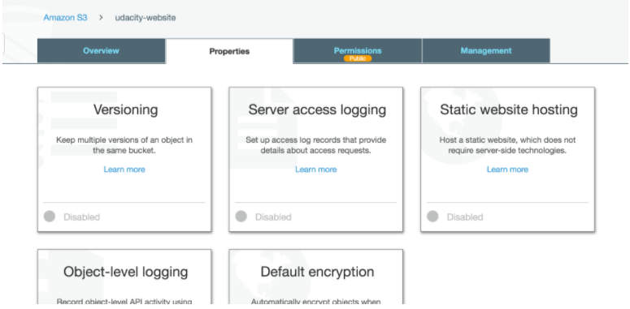
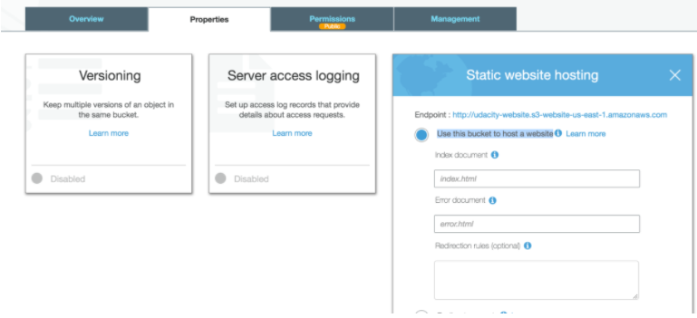

#Configure S3 Bucket
1. Click on the ```Properties``` tab and then click on ```Static website hosting```.
    
2. Click on ```Use this bucket to host a website```.
    
3. For both ```Index document``` and ```Error document```, enter ```index.html``` and click ```Save```.