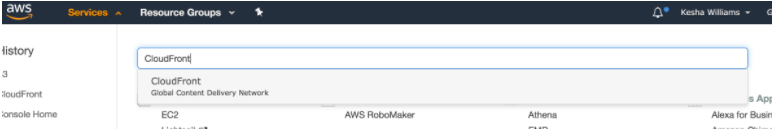
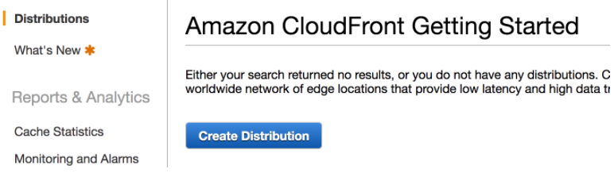
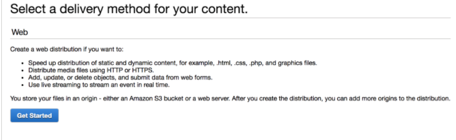
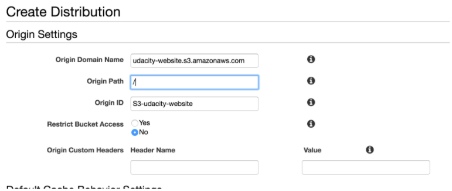
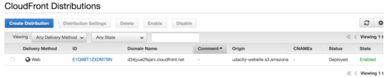

#Distribute Website via CloudFront
1. Select ```Services``` from the top left corner and enter ```cloud front``` in the ```Find a service by name or feature``` text box and select ```CloudFront```.
    
2. From the CloudFront dashboard, click ```Create Distribution```.
    
3. For ```Select a delivery method for your content```, click ```Get Started```.
    
4. Under ```Origin Settings```:
    * Under ```Origin Domain Name```, select the S3 bucket that you just created.
    * Under ```Origin Path```, enter ```/``` to indicate the root level. 
    
5. Leave the defaults for the rest of the options, scroll down, and click ```Create Distribution```.
    
    **Note**: It may take up to **10 minutes** for the CloudFront Distribution to be created.

6. Once the status of your distribution changes from ```In Progress``` to ```Deployed```, copy the endpoint URL for your CloudFront distribution found in the ```Domain Name``` column.
    

In this example, the Domain Name value is d34jyue2fsjani.cloudfront.net, but **yours will be different**.