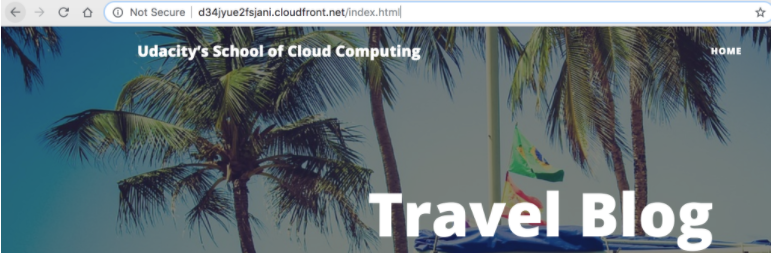

#Access Website in Web Browser
1. Open a web browser like Google Chrome and paste the copied endpoint URL and append “/index.html” on the end, as shown below.

    
2. The website displays in your browser.
    

