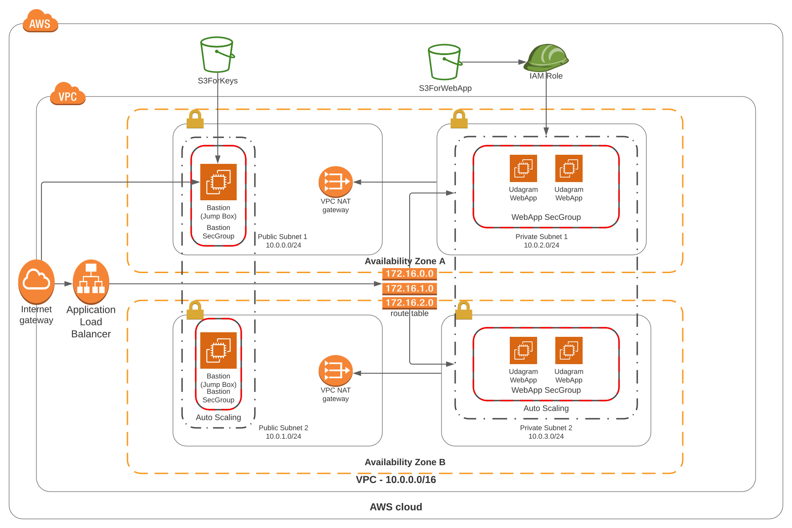

#Deploy a high-availability web app using CloudFormation

##Udacity DevOps Project 2

###Project Goal
Make web servers with high-availability using CloudFormation

###Requirements
Create a custom VPC for this project. Attach IGW(Internet Gateway) to the VPC.
Deploy four servers(EC2 instances) using Launch Configuration. Two of the servers need to be located in each of two private subnets.
Server specs: two vCPUs and at least 4GB of RAM. The Operating System to be used is Ubuntu 18. Allocate at least 10GB of disk space.
Create a S3 bucket for the severs. Attach IAM Role to servers to use the bucket.
Create a load balancer(Application Load Balancer) in public subnets. Set Load Balancer Health Check, Security Group, Target Group

### Infrastructure Diagram


###File Structure

```text
├── README.md
├── cloudformation_files
│   ├── base-infra-params.json
│   ├── base-infra.yml
│   ├── bastion-infra.yml
│   ├── create_cloudstack.sh
│   ├── s3-bucket-infra.yml
│   ├── udacity.zip
│   ├── udagram-infa.yml
│   └── update_cloudstack.sh
├── documents
│   ├── 01_Project_Introduction.md
│   ├── 02_Problem_Statement.md
│   ├── 03_Project_Requirements.md
│   └── 04_Other_Considerations.md
├── images
│   ├── WebApp_AWS_CloudFormation_Architectural_Diagram.pdf
│   ├── WebApp_AWS_CloudFormation_Architectural_Diagram.png
│   └── WebApp_AWS_CloudFormation_Architectural_Diagram.svg
└── project_images

```

##Below is a Quick Manual To Run the CloudFormation Scripts


## 1. Download
- Go to Terminal and make a folder and clone the repository in the folder.
`git clone https://github.com/sampataws/UdacityCloudDevopsProjects.git`
- Go to `cloudformation_files` folder that in the folder you have made.

## 2. base-infra.yml
- Execute `base-infra.yml` by running create.sh as follows. \
`./create.sh {YourStackName} {yml template file} {parameter json file}` \
ex) `./create.sh UdacityBaseStackPro base-infra.yml base-infra-params.json`

## 3. s3-bucket-infra.yml
S3 Buckets or DBs are considered persistent objects. So it could be normal to use just console. In this example, two S3 buckets are going to be created using CloudFormation.\
- Open `s3-bucket-infra.yml` file and edit the both bucket names what ever you want because S3 is global service so that the name of bucket has to be unique. \
ex) In my case, `udacity-devops-project-for-webapp-lwj` for Web app. `udacity-devops-project-lwj` for bastion host

- Execute `s3-bucket-infra.yml` by running create.sh as follows. \
`./create.sh {YourStackName} {yml template file} {parameter json file}` \
ex) `./create.sh UdacityS3StackPro s3-bucket-infra.yml base-infra-params.json`

## 4. Create two keys of key pairs and upload one of them.
- Go to EC2 service using AWS console. Go to `Key Pairs` under `NETWORK & SECURITY` located in left side bar.
- Create two key pair. One is needed to access bastion host(jump box) in public subnet. The other is needed to access to web servers from the bastion host. After creation, two keys are automatically saved in your local environment.
ex) The names of keys could be `ToBastion` and `ToWebServers`. In my cases, they are `Udacity_To_Bastion` and `Udacity_To_WebServers`.

- Go to S3 service using AWS console and upload `ToWebServers` key to the S3 bucket you have created already for bastion host. In my case. the bucket name is `udacity-devops-project-lwj`. Never upload `Udacity_To_Bastion` for the safety of your network. It has to be only in your local environment.

- Upload `udacity.zip` which is located in `cloudformation_file` folder to the S3 bucket you have created already for web servers. In my case. the bucket name is `udacity-devops-project-for-webapp-lwj`.

## 5. bastion-infra.yml
- Open `bastion-infra.yml` file and edit `MyIp` parameter(line 9). Change the value of `Default` to your IP address to restrict access. For example, my IP is xx.xx.xxx.xxx at the time I am writing. So it could be xx.xx.xxx.xxx/32. To find current ip, go to `Google` and type `my ip`.

- Also edit `KeyForBastion` parameter(line 19). Change the value of `Default` to your name of key for bastion host to access web servers. The default value has to be the same as the file uploaded in the S3 bucket for the bastion hosts. In my case, the default value is `Udacity_To_WebServers`. 

- Execute `bastion-infra.yml` by running create.sh as follows. \
`./create.sh {YourStackName} {yml template file} {parameter json file}` \
ex) `./create.sh UdacityBastionStackPro bastion-infra.yml base-infra-params.json`

- Go to CloudFormation using AWS console. Click the stack name you just created. It is usuful to check the progress by clicking `Events`

- After creation of the stack, you must be able to access one of bastion hosts. In my case, I can access one of bastion hosts using the key, `Udacity_To_Bastion`. Go to EC2 and click `Instances`. Click one of bastion hosts and click `Connect`. Read the instruction and execute them.

## 6. udagram-infa.yml
- Execute `udagram-infa.yml` by running create.sh as follows. \
`./create.sh {YourStackName} {yml template file} {parameter json file}` \
ex) `./create.sh UdacityWebAppStackPro udagram-infa.yml base-infra-params.json`

- After creation of the stack, It could be possible to access a wep page ran by web servers. The address of web page can be found in the output section.

- To access one of webservers, go to  Go to EC2 and click `Instances`. Click one of web servers and click `Connect`. Read the instruction and execute them.


